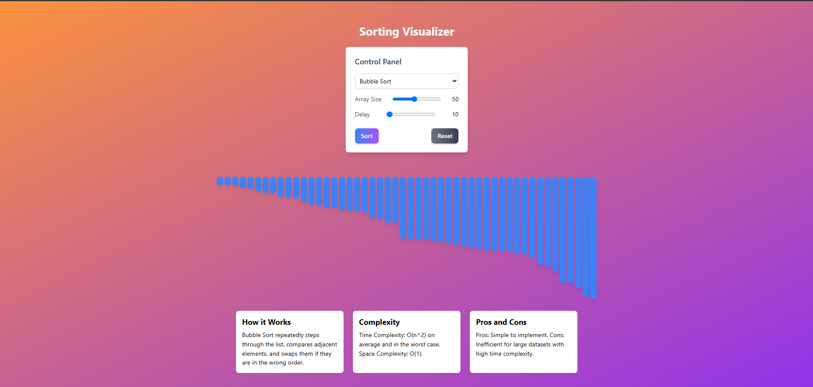

# 📊 Sorting Visualizer

An interactive sorting algorithm visualizer built with **React**, **Tailwind CSS**, and **Framer Motion**. This project allows users to visualize how different sorting algorithms work, with smooth animations and real-time customization.
Click here for demo: https://itsabhyudai.github.io/sorting_visualizer/

---
## 📸 Screenshot


---

## 🚀 Features

- 🎞️ **Animated Sorting Algorithms** – See how sorting happens step-by-step
- 🧩 **Control Panel** – Adjust:
  - **Array Size**
  - **Animation Delay**
- 💅 Built with modern tools:
  - **React**
  - **Tailwind CSS**
  - **Framer Motion** for animations

---

## 🛠️ Setup Instructions

1. **Clone the repo**
   ```bash
   git clone https://github.com/yourusername/sorting-visualizer.git
   cd sorting-visualizer

2. **Install dependencies**
   ```bash
   npm install

3. **Start the development server**
   ```bash
   npm start

Open http://localhost:3000 in your browser.

---

## 🧑🏻‍💻 Author
Made with ❤️ by Abhyudai Shrivastava!

